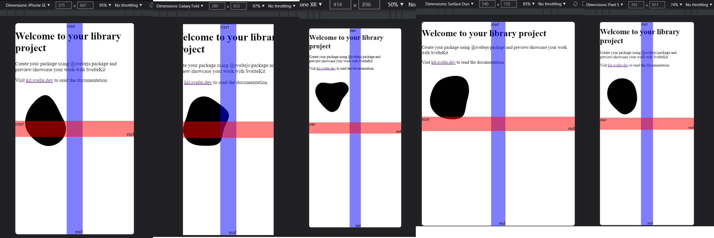
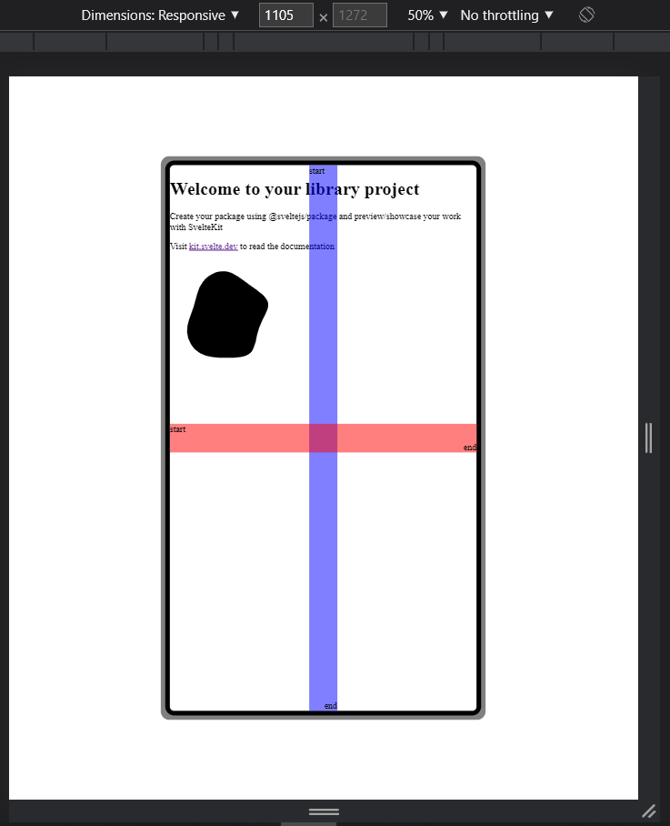
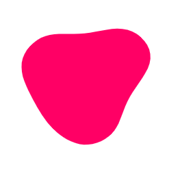

# Svelte Mobile Wrapper and Blob Components

This repository holds component definitions for:

- Mobile Wrapper: Mobile mockup container for larger screen sizes.

- Blob: Animated SVG blob

### Mobile Wrapper

Assume you've created a mobile-first design. You may now include a component in your mobile design that allows your app to still be responsive for small and medium devices. On larger devices, however, it will function as a mobile "mockup" container for your app. 

### Blob

